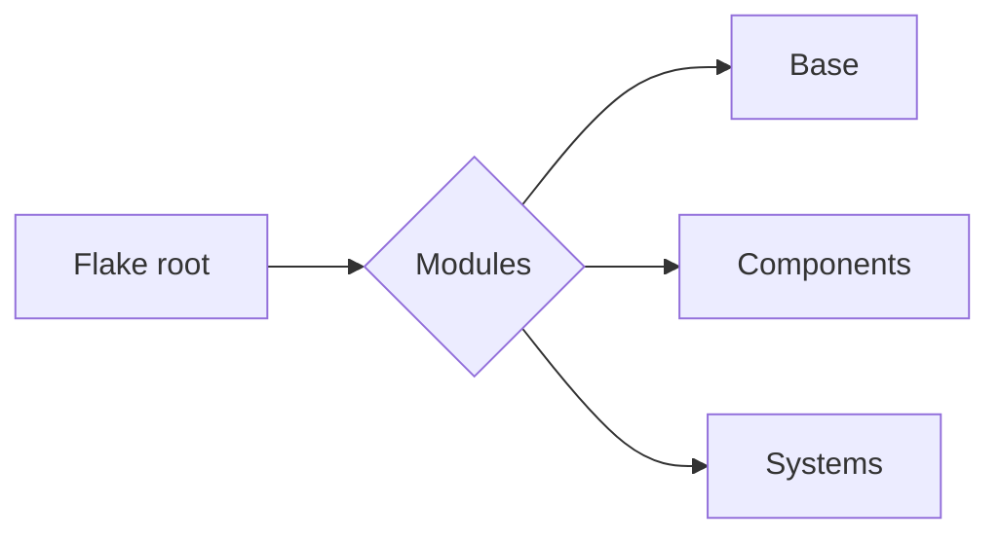
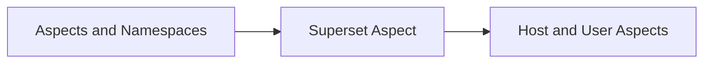

My personal NixOS configuration, built using the dendritic pattern via the [denful/den](https://github.com/denful/den) flake.

# System Information

- NixOS and Home Manager (unstable)
- Btrfs
- Stylix theming
- CachyOS kernel
- Nvidia drivers
- Flake file and import tree for pathless file and input imports

# Flake Structure

Bird's eye view of flake 
```
Flake/
├── flake.nix
├── modules
│   ├── base
│   │   ├── defaults.nix
│   │   ├── nix.nix
│   │   └── nixreaper.nix
│   ├── components
│   │   ├── componentes.nix
│   │   ├── desktop
│   │   │   ├── desktop.nix
│   │   │   ├── fonts.nix
│   │   │   ├── inputs.nix
│   │   │   ├── mango.nix
│   │   │   ├── niri.nix
│   │   │   ├── noctalia.nix
│   │   │   └── note.md
│   │   ├── environment
│   │   │   ├── inputs.nix
│   │   │   └── zsh.nix
│   │   ├── gaming
│   │   │   └── gaming.nix
│   │   ├── keyboards
│   │   │   ├── graphite.xkb
│   │   │   ├── kanata.nix
│   │   │   └── keyboards.nix
│   │   ├── packages
│   │   │   └── packages.nix
│   │   ├── theme
│   │   │   ├── inputs.nix
│   │   │   └── stylix.nix
│   │   └── virtualization
│   │       └── virtualization.nix
│   ├── dendritic.nix
│   ├── den.nix
│   ├── inputs.nix
│   ├── namespace.nix
│   ├── nh.nix
│   ├── systems
│   │   ├── nixreaper
│   │   │   ├── bootloader.nix
│   │   │   ├── filesystem.nix
│   │   │   ├── inputs.nix
│   │   │   ├── kernel.nix
│   │   │   ├── network.nix
│   │   │   ├── nvidia.nix
│   │   │   ├── power.nix
│   │   │   └── sound.nix
│   │   └── system-nixreaper.nix
│   └── tests.nix
└── README.md

```

The main folder structure is as follows:



The `modules` folder is the base of the flake's modularization, containing individual files and subfolders, each holding a dendritic aspect.

- **base/** — Host and user configurations, with Home Manager integration.
- **components/** — Host and user components such as desktop environment, packages, gaming environment, etc., each in its own subdirectory.
  - All components in this directory are imported into a single `components.nix`, so they can be imported as one aspect into the host and user aspects in `base/`.
- **systems/** — Host-specific aspects such as graphics drivers, kernel, and boot manager. Like `components/`, all system aspects are imported into one Nix file, which is then imported into the base of the respective host.
- **modules/** — Additional Nix files: general aspects applied to every host, plus den boilerplate.

Inputs are generally added in a separate Nix file close to the component that needs them. For example, Stylix's inputs live alongside the Stylix component. To register these inputs into the flake, run `nix run .#write-flake` from the flake root — this collects the inputs from all directories automatically.

## Den and the Dendritic Pattern

Dendritic Nix is a pattern in which a flake is broken down into individual components such that each one is independently usable, regardless of file path. These components can then be consumed by any host or user configuration. Den extends this further, allowing each component to be named and organized more conveniently as **aspects** and **namespaces**.

### Aspects

Aspects are the modules of the flake, individual components meant to be consumed elsewhere in the flake. Most aspects live in the same namespace as the flake itself.

Modules are written in the form of an aspect. Each aspect is a module that can be given a name and imported into a base. An aspect can contain any Nix configuration, and its key advantage is that it can be named and imported easily, regardless of its location or path.

Den boilerplate handles this so that each aspect can define configuration for both NixOS and Home Manager, which can then be imported into the host and/or user base aspects (the ones that aggregate all host and user configuration).

Example:

```nix
den.aspects.gaming = { # the gaming aspect
  nixos = { config, lib, pkgs, ... }: { # NixOS part of the aspect
    programs.steam.enable = true;
  };
  homeManager = { config, lib, pkgs, ... }: { # Home Manager part of the aspect
    home.packages = [ pkgs.mangohud ];
  };
};
```

The `gaming` aspect defines both NixOS and Home Manager configuration. For both to take effect, the aspect must be imported into both the user and host aspects. For example, if the host aspect is `den.aspects.host` and the user aspect is `den.aspects.user`, then `den.aspects.gaming` needs to be included in both `host` and `user` — unless only one type of config is actually needed.

### Aspects with `provides`

Aspects can have sub-aspects that are importable either individually or together with their parent. For example, `den.aspects.gaming` can define a sub-aspect `den.aspects.gaming.provides.nvidia`, importable in host/user aspects. Provided aspects can also be imported using the shorthand `den.aspects.gaming._.nvidia`, which expands to `den.aspects.gaming.provides.nvidia`.

Example:

```nix
den.aspects.gaming = { # the gaming aspect
  nixos = { config, lib, pkgs, ... }: { # NixOS part of the aspect
    programs.steam.enable = true;
  };
  homeManager = { config, lib, pkgs, ... }: { # Home Manager part of the aspect
    home.packages = [ pkgs.mangohud ];
  };
  provides.nvidia = { # aspect provides nvidia
    nixos = { config, lib, pkgs, ... }: { }; # NixOS part of provides
    homeManager = ...; # Home Manager part of provides
  };
};
```

Aspects are importable into other aspects, and an aspect can be composed of multiple other aspects:

```nix
den.aspects.main = {
  includes = [
    den.aspects.gaming
    den.aspects.gaming._.nvidia
  ];
};
```

Aspects are designed by den so that they can define both host and user (Home Manager) configuration in a single Nix file. For example, in the `packages` component, the `den.aspects.packages` aspect can be attributed to either `nixos = { ... };` or `homeManager = { ... };`, and it can then be imported into both the host and user base aspects. If it's only imported into the NixOS base, only `den.aspects.packages.nixos` is evaluated — so for both host and user configuration to take effect, it should be imported into both bases.

To simplify this, `den.aspects.packages` and the other component aspects are all imported into a single `components.nix`, so only `components.nix` needs to be imported into the host and user base aspects.

### Namespaces

A namespace is a type of aspect that can be fully utilized *outside* the flake. Think of it as another flake, consumed as part of the main one. The key distinction is that a namespace can be exported so other flakes can use its components unlike a plain aspect, which is only usable within the flake it belongs to.

For example, here's a namespace for a virtualization setup, so the same virtual environment configuration can be shared with other flakes:

```nix
imports = [
  (inputs.den.namespace "virt" true) # `true` allows it to be exported outside the flake
];
```

To utilize the namespace, create a Nix file using its attribute:

```nix
{ virt, ... }: # here virt is the attribute for that namespace
{
  virt.main = {
    nixos = ...;
    homeManager = ...;
    provides.subaspect = ...;
  };
}
```

Namespaces can also have `provides` (sub-aspects), just like regular aspects. Note that when importing a namespace into an aspect, the namespace attribute (`virt` in this case) must be included in that aspect's arguments.

The namespace can then be imported as:

```nix
{ virt, denm, ... }:
{
  den.aspects.main = {
    includes = [
      virt.main
      virt.main._.subaspect
    ];
  };
}
```

## Inputs and Imports

Inputs for a component are placed in that component's own directory. For example, for the `stylix` component, the inputs sit next to `stylix.nix`:

```nix
{
  flake-file.inputs = {
    stylix = {
      url = "github:nix-community/stylix";
      inputs.nixpkgs.follows = "nixpkgs";
    };
  };
}
```

Regardless of file path or location, all inputs can be registered into the main flake by running `nix run .#write-flake` from the flake root. This reads all subdirectories and manages inputs automatically.

> [!NOTE]
> Do not edit the main `flake.nix` directly as it is managed by `flake-file` parts.

External flake imports are done in the main aspect file — in this case, `stylix.nix`:

```nix
den.aspects.stylix = {
  nixos = # for NixOS
    { config, lib, pkgs, ... }:
    {
      imports = [ inputs.stylix.nixosModules.stylix ]; # NixOS import
      stylix.enable = true;
      nixpkgs.overlays = ...; # overlays can be added as well
    };

  homeManager = ...; # Home Manager import goes here
};
```

## Building the Configuration

The whole flake configuration is built with:

```sh
nixos-rebuild switch --flake .#nixreaper
```

`nixreaper` is the host name / base of the flake. Since the user configuration is also imported into `nixreaper`, this single command builds both the host and user configuration.

# Installation

## From Scratch

Install nixos as you normally would with flakes enabled in `configuratio.nix`. Clone this repo and and change `/systems/nixreaper/filesystem.nix` and other settings according to your `hardware-configuration.nix`. Other system aspects like bootloader can be modified accordingly. In flake root run `nixos-rebuild switch --flake .#nixreaper`. This will install the whole system with hostname _nixreaper_ and user _nix_

## Adding Aspects 

Simply add the aspects or namespaces in their respective directories (your own choice) and then import them either into another aspect or directyly to the hosts and user asepcts. In this flake the method is generally:

Superset aspect is used simply so that it hast to be included only once in host and user aspects.  
The general aspect template is as:

```nix
den.aspects.name = {
	nixos = ... ;
	homeManager = ...;
};
```

this creates an aspecte named `name` and provides it's host and home manager options. The ahost and User aspects are included in `/flake/modules/base` and are `nixreaper.nix` and `nix.nix` which is hostname and username respectively

## Adding Users and Hosts

To add host, take the hostname `hostreaper` as an example and username `alice` change the files accordinginly 

`/flake/modules/den.nix`
```nix
{ lib, ... }:
{
  den.hosts.x86_64-linux.nixreaper.users.nix = { }; #change or add accordingly
  den.homes.x86_64-linux.nix = { };
##### example #####
 den.hosts.x86_64-linux.hostreaper.users.alice = { };
 den.homes.x86_64-linux.alice = { };

  # enable hm for all users
  den.schema.user.classes = lib.mkDefault [ "homeManager" ];
}
```

and in `/modules/base` change or add the files to replace or addto for files `nixreaper.nix` and `nix.nix`

Considering username.nix or nix.nix  change the nix with your user name or create a new file for that specific user like `alice.nix`
```nix
{
  den,
  lib,
  virt,
  de,
  ...
}:
{
  den.aspects.nix = {

    # Alice can include other aspects.
    # For small, private one-shot aspects, use let-bindings like here.
    # for more complex or re-usable ones, define on their own modules,
    # as part of any aspect-subtree.
    includes =
      let
        # hack for nixf linter to keep findFile :/
        unused = den.lib.take.unused __findFile;
        __findFile = unused den.lib.__findFile;

      in
      [

        # from the aspect tree, cooper example is defined bellow
        den.aspects.nixadmin
        den.aspects.setHost
        # den included batteries that provide common configs.
        <den/primary-user> # alice is admin always.
        (<den/user-shell> "zsh") # default user shell
        # explicit policy activation
        den.aspects.nix.policies.to-nixreaper
        den.aspects.components
      ];

    # Alice configures NixOS hosts it lives on.
    nixos =
      { pkgs, ... }:
      {
        users.users.nix.packages = [ ];
        users.users.nix = {
          isNormalUser = true;
          extraGroups = [
            "wheel"
            "networkmanager"
            "libvirtd"
            "audio"
            "video"
            "qemu-libvirtd"
            "kvm"
            "input"
            "flatpak"
            "plugdev"
          ];
        };
      };

    # Alice home-manager.
    homeManager =
      { pkgs, ... }:
      {
        home.packages = [ ];
        nixpkgs.config.allowUnfree = true;
        #home-manager.backupFileExtension = "hm-backup";
      };

    # <user>.policies.<name>, aspect-included policy
    # Delivers NixOS config to the host (cross-scope via policy.provide).
    policies.to-nixreaper =
      { host, user, ... }:
      lib.optional (host.name == "nixreaper") (
        den.lib.policy.provide {
          class = "nixos";
          module.programs.nh.enable = true;
        }
      );

  };

  # This is a context-aware aspect, that emits configurations
  # **anytime** at least the `user` data is in context.
  # read more at https://den.denful.dev/explanation/parametric/
  den.aspects.nixadmin =
    { user, ... }:
    {
      nixos.users.users.${user.userName}.description = "Nauman Ahmad";
    };

  den.aspects.setHost =
    { host, ... }:
    {
      networking.hostName = host.hostName;
    };
}
```

and for host i.e `nixreaper.nix`
```nix
{
  den,
  lib,
  virt,
  de,
  ...
}:
{
  den.aspects.nixreaper = {
    # igloo host provides some home-manager defaults to its users.
    homeManager.programs.direnv.enable = true;

    # NixOS configuration for igloo.
    nixos =
      { pkgs, lib, ... }:
      {
        nix.settings.experimental-features = [
          "nix-command"
          "flakes"
        ];
        nixpkgs.config.allowUnfree = true;
        services.openssh.enable = true;

        time.timeZone = "Asia/Karachi";
        console = {
          font = "Lat2-Terminus16";
          keyMap = "us";
        };
      };

    # <host>.policies.<name>, aspect-included policy
    policies.to-nix =
      { host, user, ... }:
      lib.optional (user.name == "nix") (
        den.lib.policy.include {
          homeManager.programs.tmux.enable = user.name == "nix";
        }
      );

    includes = [
      den.aspects.nixreaper.policies.to-nix
      den.aspects.components
      den.aspects.system

    ];
  };
}
```

change the nixreaper with your hostname or add another host per needs. Make sure your host includes the correct users in it.   
Rebuild the system using 
```sh
nixos rebuild switch --flake .#yourhostname
```


# Credits 

- [vic](https://github.com/vic) / [denful/den](https://github.com/denful/den) for den, flake aspects and flake file parts 
- [Stylix](https://nix-community.github.io/stylix/) and awesome and well integrated theme environment for nixos 
- [Chaotic Nyx](https://www.nyx.chaotic.cx/) for providing experimental and optimized packages, kernels and filesystems 
- [Hlissner](https://github.com/hlissner) for providing inital resources un flake understanding 
- [Wolfgang](https://git.notthebe.ee/notthebee/nix-config) for making it easy to understand multiple host and user management
- [quasigod](https://tangled.org/quasigod.xyz/nixconfig) on how to extend flakes and dendritic pattern conveniently
- [Sascha Koenig](https://m3ta.dev/) for explaining practical flake applications and deployment 
- [nix.dev](https://nix.dev/) 