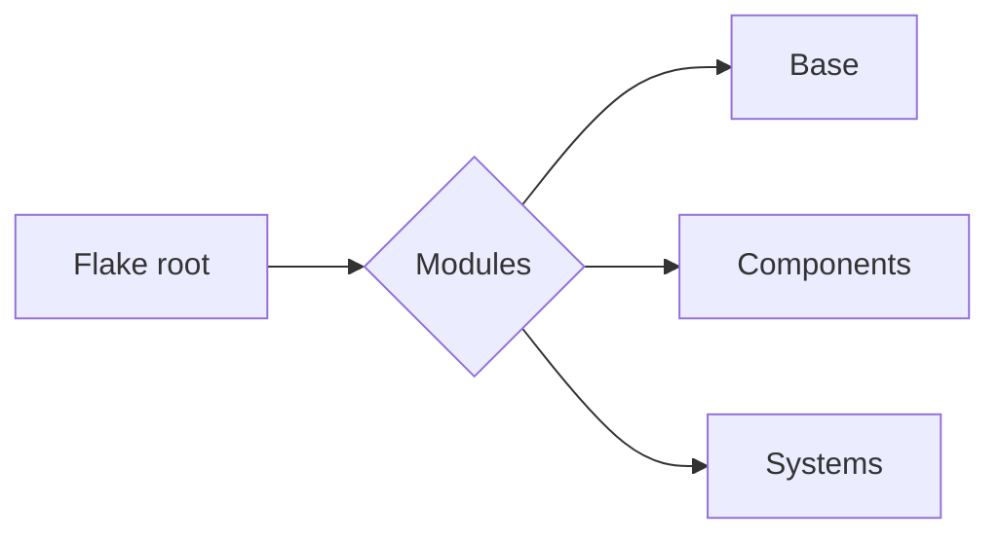
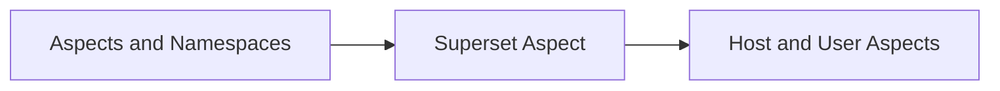

# nixidite

My personal NixOS configuration, built using the dendritic pattern via the
[denful/den](https://github.com/denful/den) flake.

Single host (`nixreaper`) and single user (`nix`) for now. The layout is
ready for more of both; see Installation below.

## System Information

- NixOS and Home Manager (unstable)
- Btrfs
- Runtime dynamic theming, no Stylix, no NixOS specialisations
- CachyOS kernel (via chaotic-nyx)
- Nvidia drivers
- Neovim via LazyVim (user config, not nvf; the nvf tree is dormant)
- Doom Emacs (daemon + emacsclient)
- Hyprland (Lua config) with Niri and MangoWC present but disabled
- Kitty and Ghostty terminals
- Noctalia shell
- Kvantum (wallbash based) for Qt6, adw-gtk3 for GTK

## Flake Structure

```
Flake/
├── flake.nix                  # generated by `nix run .#write-flake`, do not edit by hand
├── flake.lock
├── modules
│   ├── base                   # host/user bases: nix.nix, nixreaper.nix, defaults.nix
│   ├── components
│   │   ├── componentes.nix    # superset aspect, included by every host and user
│   │   ├── desktop            # de namespace: desktop, fonts, hyprland, noctalia (+ dormant niri, mango)
│   │   ├── environment        # zsh plus shell tools (zoxide, yazi, eza, bat, fzf, oh-my-posh)
│   │   ├── gaming             # steam, proton, wine, lutris
│   │   ├── keyboards          # graphite xkb layout (+ dormant kanata service)
│   │   ├── nvf                # DORMANT, kept so re-enabling needs no rewrite (see note below)
│   │   ├── packages           # system and home packages, firefox profile, btop, kitty enable
│   │   ├── theme              # den.aspects.theme: central palette plus theme-switch
│   │   └── virtualization     # virt namespace: libvirt plus podman/distrobox
│   ├── systems
│   │   ├── system-nixreaper.nix   # superset system aspect
│   │   └── nixreaper          # bootloader, filesystem, kernel, network, nvidia, power, sound
│   ├── den.nix                # host and home declarations
│   ├── dendritic.nix          # dendritic boilerplate (flake-file pin lives here)
│   ├── inputs.nix             # core inputs (nixpkgs, home-manager, darwin)
│   ├── namespace.nix          # virt, de, neo namespaces
│   ├── nh.nix                 # nh helper packages
│   └── tests.nix              # `nix flake check` assertions on the real topology
└── README.md
```


```mermaid
flowchart LR
    A["Flake root"]
    A --> B{"Modules"}
    B --> C["Base"]
    B --> D["Components"]
    B --> E["Systems"]
```

- **base/**: host and user aspects with Home Manager integration.
- **components/**: host and user components, each in its own subdirectory.
  All components are imported into a single `componentes.nix`, so only that
  one needs including in the host and user base aspects.
- **systems/**: host specific aspects (graphics, kernel, boot, network).
  Same pattern: everything folds into one `system-nixreaper.nix`.
- **modules/** root files: shared aspects plus den boilerplate.

Inputs live next to the component that uses them (for example the
`dotfiles` input next to the zsh environment, `noctalia` next to the
desktop). Register them with `nix run .#write-flake` from the flake root,
which collects inputs from all directories automatically.

## Den and the Dendritic Pattern

Dendritic Nix breaks a flake into individual components such that each one
is independently usable, regardless of file path. Den extends this by
letting each component be named and organized as aspects and namespaces.

### Aspects

Each aspect is a module that can define NixOS and Home Manager
configuration in one file, then be included wherever it is needed:

```nix
den.aspects.gaming = {
  nixos = { config, lib, pkgs, ... }: {
    programs.steam.enable = true;
  };
  homeManager = { config, lib, pkgs, ... }: {
    home.packages = [ pkgs.mangohud ];
  };
};
```

For both halves to take effect the aspect must be included in both the
host and the user base aspects. This flake simplifies that with superset
aspects (`componentes.nix` for everything, `system-nixreaper.nix` for the
system side), so hosts and users include one aspect each.

### Aspects with `provides`

Aspects can carry sub aspects importable on their own or with the parent,
using either the long form or the shorthand:

```nix
den.aspects.gaming = {
  nixos = ...;
  homeManager = ...;
  provides.nvidia = {
    nixos = ...;
    homeManager = ...;
  };
};

den.aspects.main = {
  includes = [
    den.aspects.gaming
    den.aspects.gaming._.nvidia   # shorthand for provides.nvidia
  ];
};
```

In this flake, `provides` is used for `zsh.environment`, `packages.pkconf`,
`virt` podman, and the host to user policies in `base/`.

### Namespaces

A namespace is an aspect collection usable outside the flake, declared in
`namespace.nix` (`virt`, `de`, `neo`). Namespaces support `provides` the
same way aspects do.

### Authoring a new file

Every component file follows the same skeleton (this used to live in
`template.txt`, now documented here):

```nix
{ den, lib, ... }:
{
  den.aspects.example = {
    nixos = { config, lib, pkgs, ... }: {
      # host side
    };
    homeManager = { config, lib, pkgs, ... }: {
      # user side
    };
    provides.subexample = {
      nixos = { config, lib, pkgs, ... }: {
        # optional sub aspect
      };
    };
  };
}
```

Then include it in the superset (`componentes.nix`) or directly in a host
or user aspect:

```nix
includes = [
  den.aspects.gaming
  den.aspects.gaming._.emulation
];
```

Namespace files use their namespace attribute instead of `den`:

```nix
{ de, ... }:
{
  de.hyprland = {
    nixos = { pkgs, ... }: { ... };
    homeManager = { pkgs, ... }: { ... };
  };
}
```

## Inputs and Imports

Inputs for a component sit next to that component:

```nix
{
  flake-file.inputs = {
    noctalia = {
      url = "github:noctalia-dev/noctalia";
      inputs.nixpkgs.follows = "nixpkgs";
    };
  };
}
```

Run `nix run .#write-flake` from the flake root to collect them into
`flake.nix`. This requires `flake-file` pinned to `github:denful/flake-file`
(see `modules/dendritic.nix`); the `vic` fork defines a conflicting URL and
breaks regeneration.

## Theming

Theming is fully runtime driven. There is no Stylix and there are no NixOS
specialisations. One central palette in `modules/components/theme/theme.nix`
defines 10 themes (gruvbox, kanagawa, kanagawa-dragon, tokyonight, rosepine,
catppuccin, everforest, dracula, nord, onedark). Pure Nix generators render
every theme for every app at build time into `~/.config/mytheme/themes/`,
and `theme-switch <name>` flips symlinks plus reloads running apps. No
rebuild is ever needed to change theme.

Covered apps: kitty, ghostty, hyprland, Noctalia palettes, Kvantum
standalone themes (wallbash based, see below), GTK css, oh-my-posh, LazyVim
colors, Doom style, yazi, fzf/bat shell env, neomark css, kdeglobals colors,
Firefox chrome.

Per app notes:

- Kvantum themes are generated from the wallbash base stored in dot-nix
  (`<theme>/noctalia/templates/kvantum.*`, identical in all six dirs).
  The mapping is key aware, not a blind hex swap. Selected via
  `kvantummanager --set` inside `theme-switch`; running Qt apps need a
  restart, which is a Qt limitation, not a bug in the setup.
- Firefox chrome follows the theme through a static `userChrome.css` that
  only imports the active per-theme file. Restart Firefox to apply.
- Neovim and Emacs follow on restart (or `:colorscheme` / theme reload).
- The SDDM login screen is intentionally static (gruvbox astronaut theme);
  the login screen cannot hot switch safely.
- Papirus-Dark icons, Bibata-Modern-Ice cursor, FiraCode/Ubuntu Sans fonts
  are static by design and shared by all themes.

Adding a theme means adding one record to the palette. Adding an app means
one `mkApp` generator plus one store entry plus one `theme-switch` link;
see the existing generators for the pattern.

## Building the Configuration

```sh
nixos-rebuild switch --flake .#nixreaper
```

`nixreaper` is the host name. User configuration is imported into it, so
one command builds host plus user. `nh` is enabled on the host as well.
Inside a distrobox container, prefix host Nix commands with
`distrobox-host-exec` (for example
`distrobox-host-exec nixos-rebuild switch --flake .#nixreaper`).

Checks:

```sh
nix flake check   # assertions in modules/tests.nix
```

## Installation

### From Scratch

Install NixOS as you normally would with flakes enabled. Clone this repo,
then adapt to the new machine: new `hardware-configuration.nix` values in
`modules/systems/<host>/` (UUIDs, kernel modules, bus IDs), a new host and
user entry in `modules/den.nix`, and host/user aspects under `modules/base/`
following the `nix` / `nixreaper` examples. Parameterize, do not hardcode:
`STEAM_EXTRA_COMPAT_TOOLS_PATH` and the Atlas mountpoint follow the den
user home, and no UID is hardcoded (ssh-agent comes from
`programs.ssh.startAgent`). Then:

```sh
nixos-rebuild switch --flake .#<hostname>
```

### Restoring 1:1 state on a new PC

After the first switch, follow the dot-nix README (manual placement files
for ghostty, pcmanfm-qt, GTK2, dolphin), restore `~/Pictures/Wallpapers`
(Noctalia references it by absolute path), SSH keys, and browser state via
Firefox Sync. Then re-login, run `theme-switch <name>`, and restart
long lived apps. Caches (lazy.nvim, Doom straight, Noctalia state) rebuild
themselves; run `~/.config/emacs/bin/doom sync` once for Doom.

### Adding Aspects

Add the aspect file in a sensible directory and include it in the superset
or directly in host/user aspects:


```mermaid
flowchart LR
	A["Aspects and Namespaces"]
	A --> B["Superset Aspect"]
	B --> C["Host and User Aspects" ]

```

### Adding Users and Hosts

Add entries in `modules/den.nix`:

```nix
{ lib, ... }:
{
  den.hosts.x86_64-linux.hostreaper.users.alice = { };
  den.homes.x86_64-linux.alice = { };

  den.schema.user.classes = lib.mkDefault [ "homeManager" ];
}
```

Then add `alice.nix` (user aspect) under `modules/base/` following
`nix.nix`, and `hostreaper` host files following `nixreaper.nix` plus a
`systems/` subtree. Rebuild with
`nixos-rebuild switch --flake .#hostreaper`.

## Tips and Troubleshooting

- `theme-switch --list` shows all themes; switching never needs a rebuild.
- Running Qt/GTK apps, terminals showing old colors, nvim, and Emacs need a
  restart (or in app reload) after a switch; new instances follow instantly.
- `*.hm-backup` / `*.pre-theme-switch-bak` files are your pre-existing
  files preserved by Home Manager or the switcher; diff and delete when
  happy.
- Doom issues: run `~/.config/emacs/bin/doom doctor`.
- After changing dot-nix content: commit, push, then
  `nix flake lock --update-input dotfiles` here before rebuilding, otherwise
  the flake resolves the old rev.
- The `nvf` tree under `modules/components/nvf/` is dormant on purpose so
  re-enabling needs no rewrite. If it is ever re-enabled, its
  `.config/neomark/markdown.css` collides with the theme owned path and must
  move into the theme store first.

## Credits

- [vic](https://github.com/vic) / [denful/den](https://github.com/denful/den) for den, flake aspects and flake file parts
- [Noctalia](https://github.com/noctalia-dev/noctalia) for the desktop shell
- [Kvantum](https://github.com/tsujan/Kvantum) and the wallbash base theme for Qt styling
- [Chaotic Nyx](https://www.nyx.chaotic.cx/) for kernels and packages
- [Hlissner](https://github.com/hlissner) for Doom Emacs, encouraging to learn nix extensively and providing relevant sources.
- [Wolfgang](https://git.notthebe.ee/notthebee/nix-config) for making it easy to understand multi host and user management 
- [Quasigod](https://tangled.org/quasigod.xyz/nixconfig) for his configs making it easy to understand den organization and extension 
- [Sascha Koenig](https://m3ta.dev/) for explaining practical flake application and deployments 
- [nix.dev](https://nix.dev/)
